# lightning-pool Benchmarks

_Generated automatically by `npm run bench` (or standalone via `npm run bench:report`). Do not hand-edit — re-run one of those instead._

## Contents

- [Methodology](#methodology)
  - [Disclosed asymmetries](#disclosed-asymmetries)
- [Environment](#environment)
- [Sequential Acquire/Release](#sequential-acquirerelease)
- [Concurrent Acquire/Release](#concurrent-acquirerelease)
- [Queue Contention](#queue-contention)
- [Create/Destroy Churn](#createdestroy-churn)
- [Validate on Borrow](#validate-on-borrow)
- [Raw data](#raw-data)

## Methodology

These numbers are produced by `benchmark/` (run via `npm run bench`), comparing lightning-pool against [generic-pool](https://github.com/coopernurse/node-pool) driving an identical simulated resource (see `benchmark/resource.ts`) - no real database or socket involved, so the numbers isolate each pool's own bookkeeping and scheduling overhead rather than any backend's latency. See [benchmark/README.md](../benchmark/README.md) for how to reproduce them.

Each scenario is implemented once per library, using that library's own idiomatic API (lightning-pool's `acquire`/`releaseAsync`/`destroyAsync` vs. generic-pool's `acquire`/`release`/`destroy`), while both read the exact same pool-size/concurrency knobs from `benchmark/scenarios/*.ts`. Only the pooling mechanism varies, not the workload.

Each `(library, scenario)` pair runs in its own child process, spawned sequentially (never in parallel), to avoid CPU contention skewing numbers and to get clean, uncontaminated V8 JIT warm-up per run. The default matrix runs each pair `--repeats=3` times; the tables below report the **median across repeats**, with intra-run p75/p99 latency and ops/sec from tinybench's own sample statistics.

Each table also reports **GC (ms/op)** and **Peak Heap (KB)** - allocation pressure, not just wall-clock speed. GC (ms/op) is the total time spent in garbage collection during the run (observed via `node:perf_hooks`, every GC pause regardless of cause), divided by the number of timed samples. Peak Heap (KB) isn't a per-call figure: each worker process is started with `--expose-gc`, forces a clean GC immediately before the run to get a baseline `heapUsed`, then tracks the highest `heapUsed` seen at any point during the run - the most the heap ever grew above that baseline while running the whole scenario. Both include tinybench's own warmup iterations (it doesn't expose a hook at the boundary between warmup and the timed run).

By default every simulated resource's `create()`/`destroy()` resolves immediately (0ms) so the numbers measure pure pool overhead. Set `BENCH_CREATE_DELAY_MS`/`BENCH_DESTROY_DELAY_MS` to approximate a real backend's connection cost instead: `BENCH_CREATE_DELAY_MS=5 npm run bench`.

**Why GC/heap sampling needs a forced yield here.** Neither scenario does real I/O, so a pool whose hot path resolves entirely through chained `Promise`s (no timer/socket in between) can run its whole scenario without Node's event loop ever reaching a macrotask turn - and both `node:perf_hooks`' `'gc'` performance entries and a plain polling timer are only delivered/fire on such a turn. Left unpatched, this reads back as `gcCount=0`/`peakHeap=0` for whichever library's task happens to chain purely through microtasks, indistinguishable from genuinely zero allocation (confirmed directly: a raw, uninstrumented 2,000,000-iteration acquire/release loop reports zero for *both* libraries here, even though real GCs are demonstrably happening - inserting a periodic `setImmediate` yield in that same raw loop immediately surfaces hundreds of real GC events and tens of MB of real heap growth). `benchmark/runner/worker.ts`'s `installPeriodicYield()` fixes this at the source: it patches `bench.add()` to insert a real `setImmediate` yield (plus a heap sample) into the task's `afterEach` hook every 250 samples. tinybench's own time budget only accumulates the timed `fn()` duration, not hook time (see its `Task` internals), so this yield doesn't shrink the sample count or skew Mean/p75/p99/ops-per-sec - it only makes the whole run take a little longer in real wall-clock time, which is what makes GC (ms/op) and Peak Heap (KB) trustworthy enough to compare between libraries at all.

### Disclosed asymmetries

1. **Validation** - lightning-pool's `validation` option and generic-pool's `testOnBorrow` option are conceptually equivalent (both call `factory.validate()` before handing a resource out) but are each library's own native mechanism, not a shared shim.
2. **Queue depth** - generic-pool's `maxWaitingClients` and lightning-pool's `maxQueue` are each set to (at least) the scenario's concurrency so neither library ever rejects a request for being over capacity; the numbers measure queueing/scheduling cost, not admission-control behaviour.
3. **Resource shape** - both libraries pool the exact same plain `{ id, destroyed }` object (see `benchmark/resource.ts`), so no library gains or loses time doing work specific to a real resource type.

## Environment

- Run date: 2026-09-08T13:35:32.707Z
- Node.js: v24.15.0
- OS: Darwin 25.6.0 (darwin/arm64)
- CPU: Apple M1 Pro (10 logical cores)
- RAM: 16.0 GB total
- Library versions (installed, not this repo's semver range): lightning-pool 4.13.0, generic-pool 3.9.0

## Sequential Acquire/Release

A single `acquire()` followed by a `release()`, one at a
time, against a pool of max size 10 that has
already warmed up (the resource is always idle and immediately reusable).
The baseline "warm path" cost of the pool's own bookkeeping, with no
contention and no resource creation in the timed path. (poolSize=10)

| Library | Mean (ms) | p75 (ms) | p99 (ms) | ops/sec | vs. slowest | GC (ms/op) | Peak Heap (KB) |
|---|---:|---:|---:|---:|---:|---:|---:|
| lightning-pool (4.13.0) | ***0.0005*** | ***0.0005*** | ***0.0009*** | ***2295293.7*** | ***1.14x*** | ***0.0000*** | ***46427.88*** |
| generic-pool (3.9.0) | 0.0005 | 0.0005 | 0.0011 | 2023524.5 | 1.00x | 0.0000 | 72265.55 |

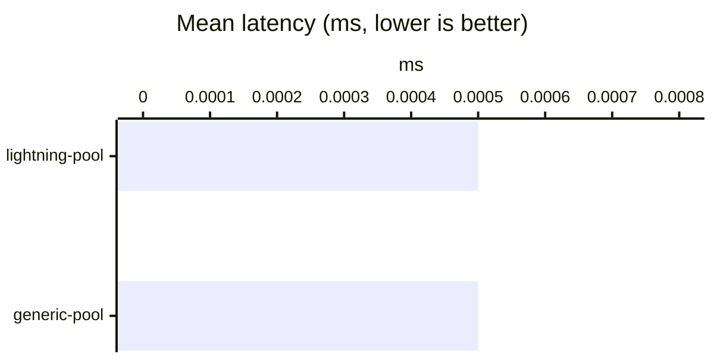

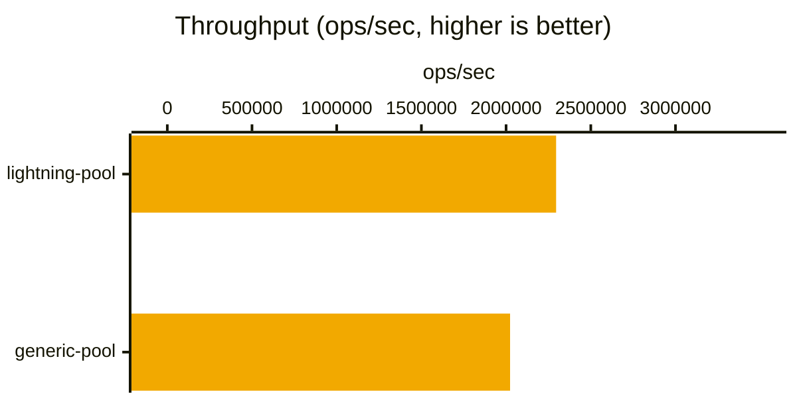

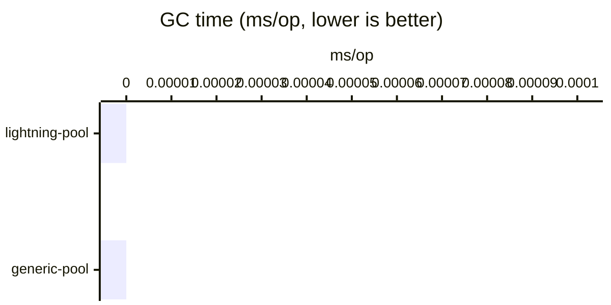

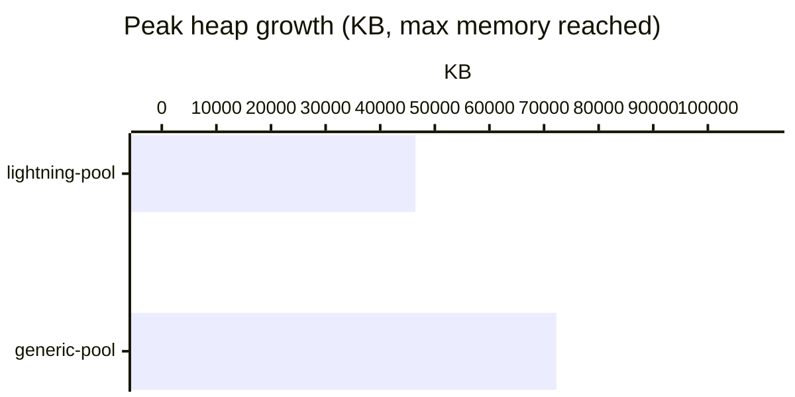

## Concurrent Acquire/Release

50 `acquire()` calls
fired at once via `Promise.all`, each released immediately after, against a
pool sized exactly to the concurrency (max=50)
so every call is satisfied from the idle pool with no queueing. Measures the
pool's concurrent-safety bookkeeping in isolation from queue contention. (poolSize=50, concurrency=50)

| Library | Mean (ms) | p75 (ms) | p99 (ms) | ops/sec | vs. slowest | GC (ms/op) | Peak Heap (KB) |
|---|---:|---:|---:|---:|---:|---:|---:|
| lightning-pool (4.13.0) | ***0.0239*** | ***0.0224*** | ***0.0739*** | ***44168.6*** | ***1.14x*** | ***0.0017*** | ***29785.13*** |
| generic-pool (3.9.0) | 0.0272 | 0.0255 | 0.0879 | 39166.2 | 1.00x | 0.0019 | 40802.12 |

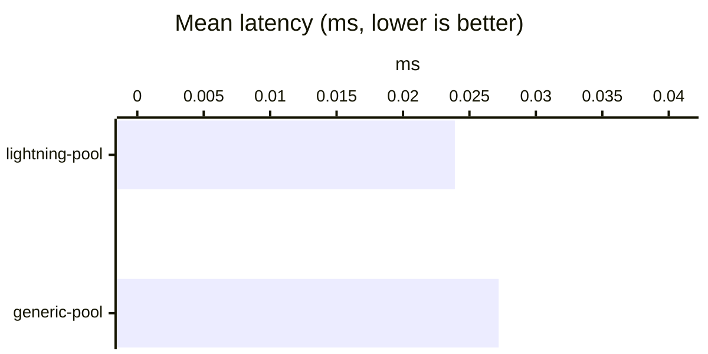

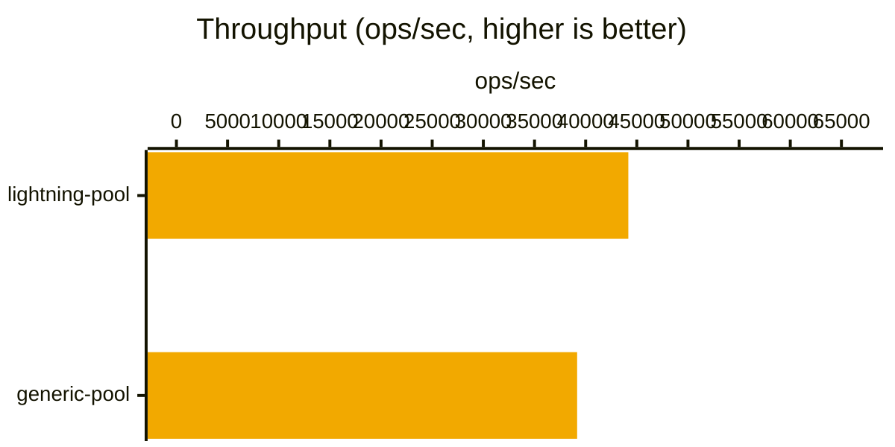

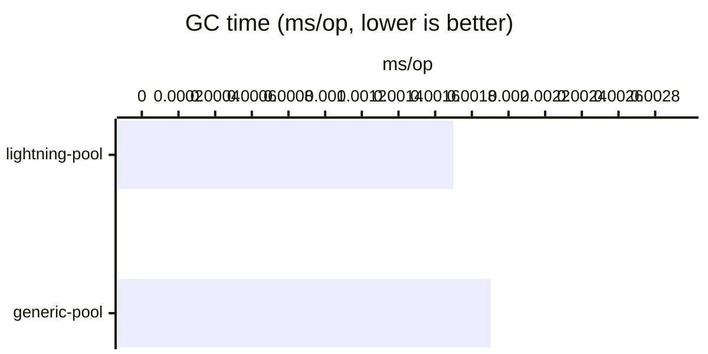

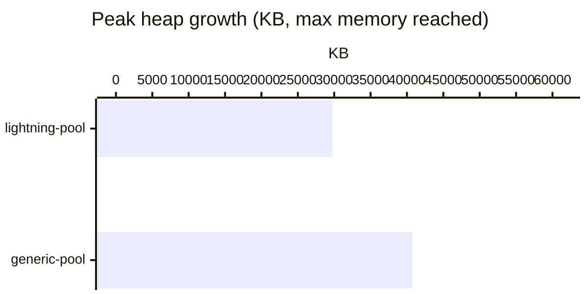

## Queue Contention

500 `acquire()` calls fired at
once via `Promise.all` against a pool of max size
10 - the overwhelming majority must queue and wait
for a resource to be released back before they can be served. Each holder
releases its resource right after acquiring it, so the queue continuously
drains. This is the scenario the pool's request queue and scheduling logic
matter most for. (poolSize=10, concurrency=500)

| Library | Mean (ms) | p75 (ms) | p99 (ms) | ops/sec | vs. slowest | GC (ms/op) | Peak Heap (KB) |
|---|---:|---:|---:|---:|---:|---:|---:|
| lightning-pool (4.13.0) | ***0.2337*** | ***0.2213*** | ***0.5334*** | ***4474.3*** | ***1.15x*** | 0.0166 | 32565.05 |
| generic-pool (3.9.0) | 0.2682 | 0.2607 | 0.5640 | 3822.1 | 1.00x | ***0.0130*** | ***20323.23*** |

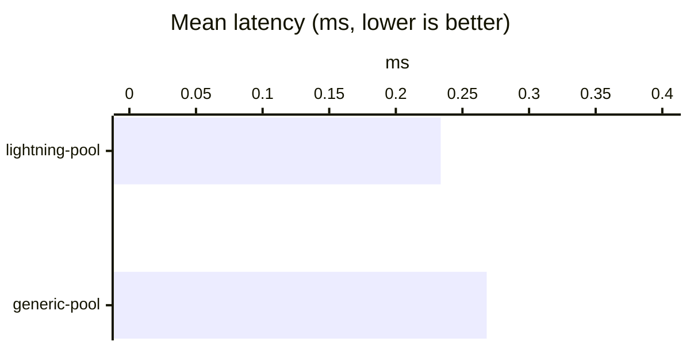

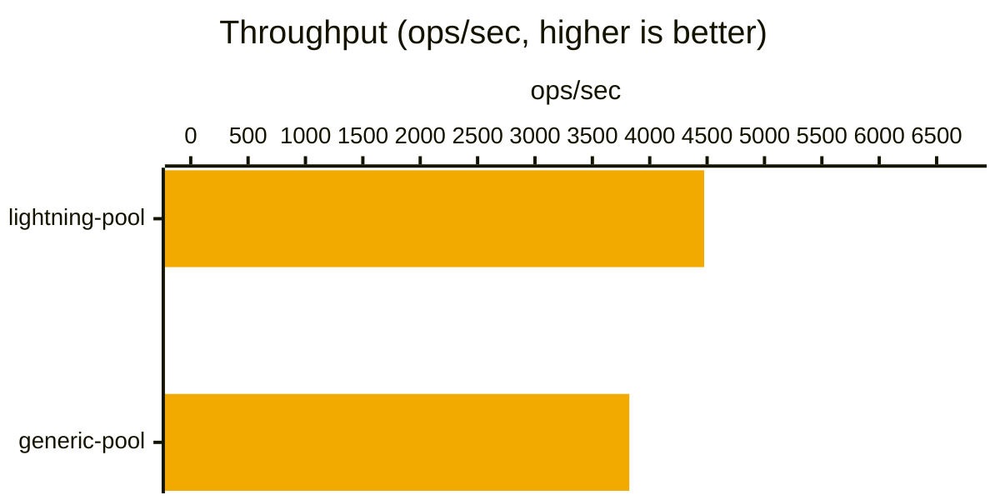

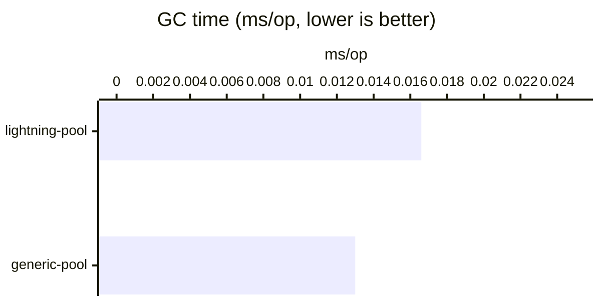

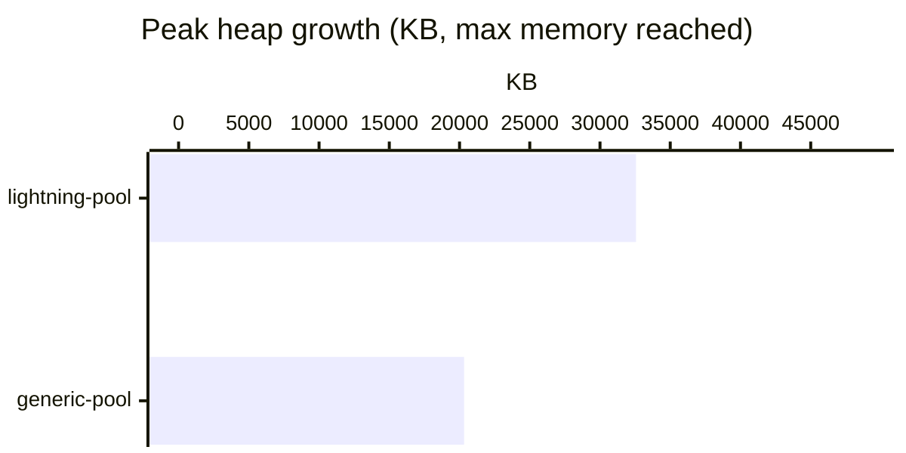

## Create/Destroy Churn

10 concurrent `acquire()`
+ `destroy()` cycles per iteration - the resource is destroyed instead of
released, so it never returns to the idle list and a brand-new one must be
created for every single acquire (pool max=10).
Isolates the factory create/destroy pipeline overhead from the idle-reuse
path the other scenarios mostly exercise. Set `BENCH_CREATE_DELAY_MS`/
`BENCH_DESTROY_DELAY_MS` to approximate a real backend's connection cost. (poolSize=10, concurrency=10)

| Library | Mean (ms) | p75 (ms) | p99 (ms) | ops/sec | vs. slowest | GC (ms/op) | Peak Heap (KB) |
|---|---:|---:|---:|---:|---:|---:|---:|
| lightning-pool (4.13.0) | ***0.0091*** | ***0.0086*** | ***0.0314*** | ***121418.4*** | ***1.43x*** | ***0.0011*** | ***112372.29*** |
| generic-pool (3.9.0) | 0.0130 | 0.0120 | 0.0408 | 84909.0 | 1.00x | 0.0018 | 118058.28 |

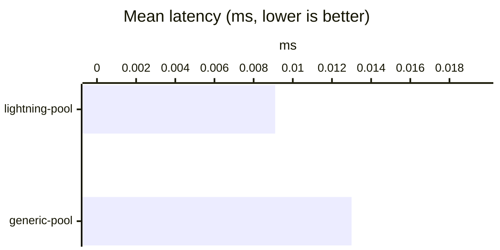

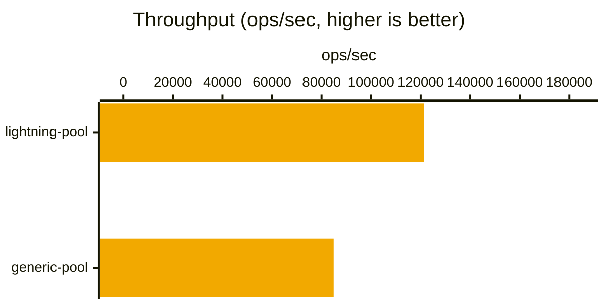

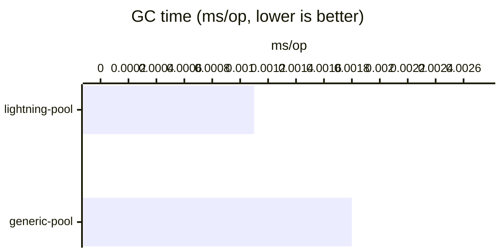

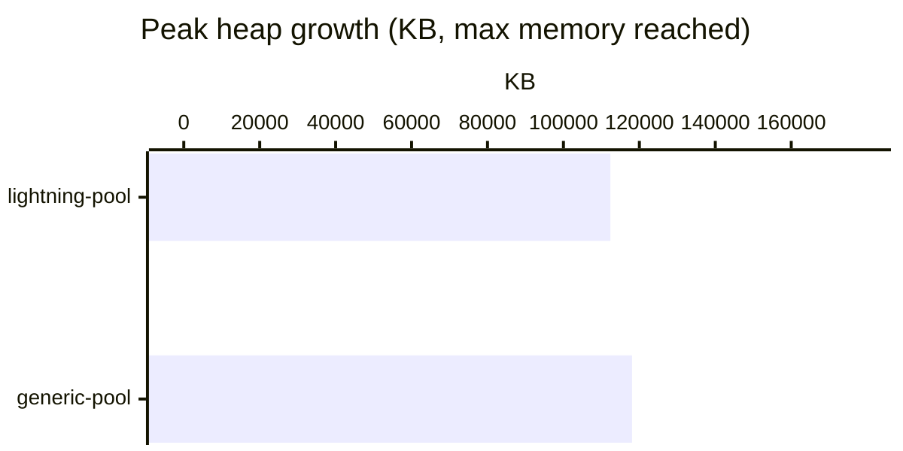

## Validate on Borrow

Same shape as Concurrent Acquire/Release
(50 concurrent acquire+release cycles,
pool max=50), but with each library's
borrow-time validation hook enabled (lightning-pool's `validation: true` +
`factory.validate`, generic-pool's `testOnBorrow: true` +
`factory.validate`) - isolates the added cost of validating a resource
before handing it out. (poolSize=50, concurrency=50)

| Library | Mean (ms) | p75 (ms) | p99 (ms) | ops/sec | vs. slowest | GC (ms/op) | Peak Heap (KB) |
|---|---:|---:|---:|---:|---:|---:|---:|
| lightning-pool (4.13.0) | ***0.0276*** | ***0.0249*** | ***0.0998*** | ***39526.5*** | ***1.42x*** | 0.0022 | 46813.63 |
| generic-pool (3.9.0) | 0.0391 | 0.0374 | 0.1250 | 26761.0 | 1.00x | ***0.0021*** | ***16179.91*** |

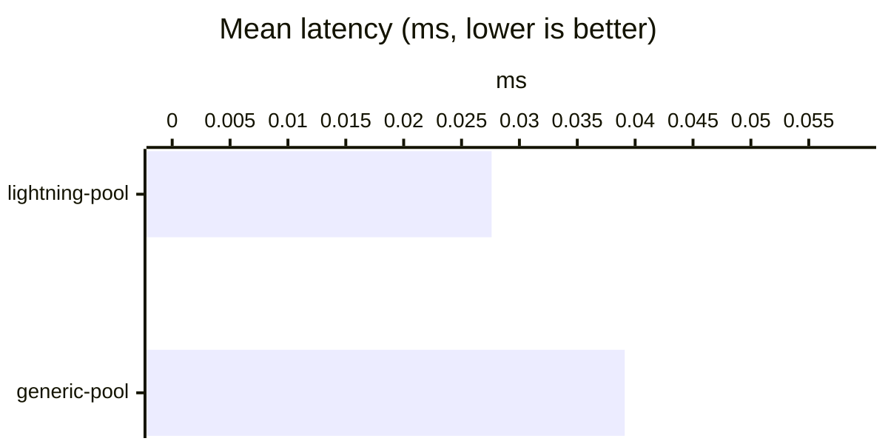

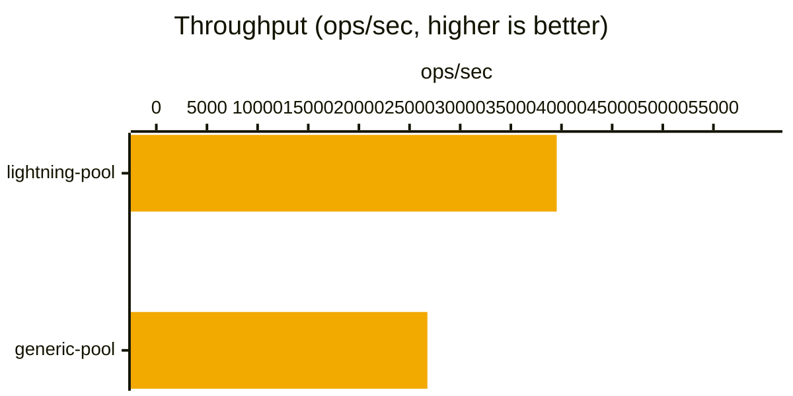

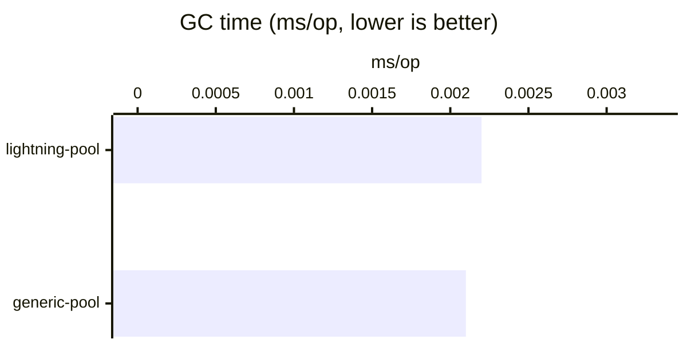

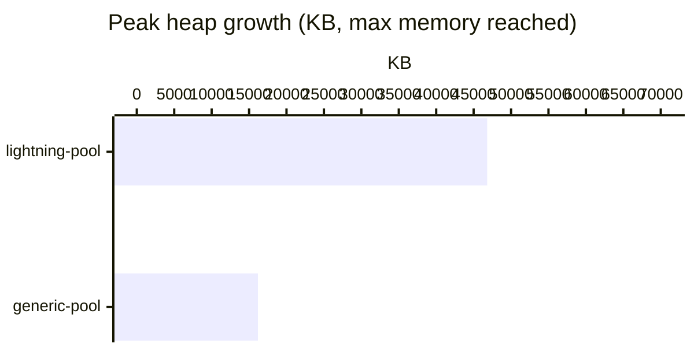

## Raw data

Backing raw data for the numbers above lives in `benchmark/results/*.json` (gitignored; regenerate with `npm run bench`).
